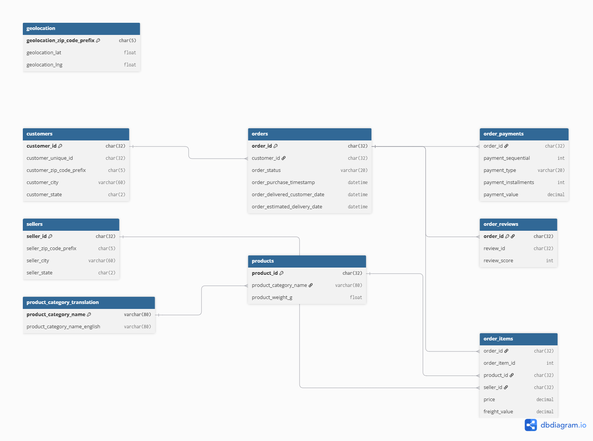

# Cart2Insights Data Dictionary

### customers (99,441 rows)
| Column | Type | Key | Description |
|---|---|---|---|
| customer_id | CHAR(32) | PK | Unique key per order; does not identify a unique person |
| customer_unique_id | CHAR(32) | — | Unique key per actual customer (stable across multiple orders) |
| customer_zip_code_prefix | CHAR(5) | — | First 5 digits of customer postal code |
| customer_city | VARCHAR(60) | — | Customer city name |
| customer_state | CHAR(2) | — | Customer Brazilian state code |

### geolocation (1,000,163 rows)
| Column | Type | Key | Description |
|---|---|---|---|
| geolocation_zip_code_prefix | CHAR(5) | PK | First 5 digits of postal code |
| geolocation_lat | FLOAT64 | — | Latitude coordinate |
| geolocation_lng | FLOAT64 | — | Longitude coordinate |
| geolocation_city | VARCHAR(60) | — | City name |
| geolocation_state | CHAR(2) | — | Brazilian state code |

### order_items (112,650 rows)
| Column | Type | Key | Description |
|---|---|---|---|
| order_id | CHAR(32) | PK, FK | Foreign key to `orders.order_id` (Composite PK with `order_item_id`) |
| order_item_id | INT64 | PK | Sequential number identifying item inside the same order |
| product_id | CHAR(32) | FK | Foreign key to `products.product_id` |
| seller_id | CHAR(32) | FK | Foreign key to `sellers.seller_id` |
| shipping_limit_date | DATETIME | — | Seller shipping limit date for handling order |
| price | FLOAT64 | — | Item price |
| freight_value | FLOAT64 | — | Item freight (shipping) cost |

### order_payments (103,886 rows)
| Column | Type | Key | Description |
|---|---|---|---|
| order_id | CHAR(32) | PK, FK | Foreign key to `orders.order_id` (Composite PK with `payment_sequential`) |
| payment_sequential | INT64 | PK | Sequence number for multi-payment orders |
| payment_type | VARCHAR(20) | — | Payment method (credit_card, boleto, voucher, debit_card) |
| payment_installments | INT64 | — | Number of installments chosen by customer |
| payment_value | FLOAT64 | — | Total transaction value of the payment |

### order_reviews (99,224 rows)
| Column | Type | Key | Description |
|---|---|---|---|
| review_id | CHAR(32) | PK | Unique identifier for the review |
| order_id | CHAR(32) | FK | Foreign key to `orders.order_id` |
| review_score | INT64 | — | Customer satisfaction rating from 1 to 5 |
| review_comment_title | TEXT | — | Title of customer review comment |
| review_comment_message | TEXT | — | Body text of customer review comment |
| review_creation_date | DATETIME | — | Timestamp when survey was sent to customer |
| review_answer_timestamp | DATETIME | — | Timestamp when customer submitted review |

### orders (99,441 rows)
| Column | Type | Key | Description |
|---|---|---|---|
| order_id | CHAR(32) | PK | Unique identifier for each order |
| customer_id | CHAR(32) | FK | Foreign key to `customers.customer_id` |
| order_status | VARCHAR(20) | — | Status of the order (e.g., delivered, shipped, canceled) |
| order_purchase_timestamp | DATETIME | — | Timestamp when the order was placed |
| order_approved_at | DATETIME | — | Timestamp when payment was approved |
| order_delivered_carrier_date | DATETIME | — | Timestamp when order was handed to logistics partner |
| order_delivered_customer_date | DATETIME | — | Actual delivery date to customer |
| order_estimated_delivery_date | DATETIME | — | Estimated delivery date promised to customer |

### products (32,951 rows)
| Column | Type | Key | Description |
|---|---|---|---|
| product_id | CHAR(32) | PK | Unique identifier for each product |
| product_category_name | VARCHAR(80) | FK | Foreign key to `product_category_translation.product_category_name` |
| product_name_lenght | FLOAT64 | — | Character length of product title |
| product_description_lenght | FLOAT64 | — | Character length of product description |
| product_photos_qty | FLOAT64 | — | Number of product photos published |
| product_weight_g | FLOAT64 | — | Product weight in grams |
| product_length_cm | FLOAT64 | — | Product length in centimeters |
| product_height_cm | FLOAT64 | — | Product height in centimeters |
| product_width_cm | FLOAT64 | — | Product width in centimeters |

### sellers (3,095 rows)
| Column | Type | Key | Description |
|---|---|---|---|
| seller_id | CHAR(32) | PK | Unique identifier for each seller |
| seller_zip_code_prefix | CHAR(5) | — | First 5 digits of seller postal code |
| seller_city | VARCHAR(60) | — | Seller city location |
| seller_state | CHAR(2) | — | Seller Brazilian state code |

### product_category_translation (71 rows)
| Column | Type | Key | Description |
|---|---|---|---|
| product_category_name | VARCHAR(80) | PK | Category name in Portuguese |
| product_category_name_english | VARCHAR(80) | — | Category name translated into English |

## Relationships

- `orders.customer_id` → `customers.customer_id`
- `order_items.order_id` → `orders.order_id`
- `order_items.product_id` → `products.product_id`
- `order_items.seller_id` → `sellers.seller_id`
- `order_payments.order_id` → `orders.order_id`
- `order_reviews.order_id` → `orders.order_id`
- `products.product_category_name` → `product_category_translation.product_category_name`
- `customers.customer_zip_code_prefix` / `sellers.seller_zip_code_prefix` → `geolocation.geolocation_zip_code_prefix` (Logical link)

## Key distinction: customer_id vs customer_unique_id

`customer_id` is generated fresh for every order — one customer placing 3 orders gets 3 different `customer_id`s. `customer_unique_id` is the one that's stable per person. **Any repeat-customer or customer-lifetime analysis must group by `customer_unique_id`, not `customer_id`**, or every customer looks like a first-time buyer.